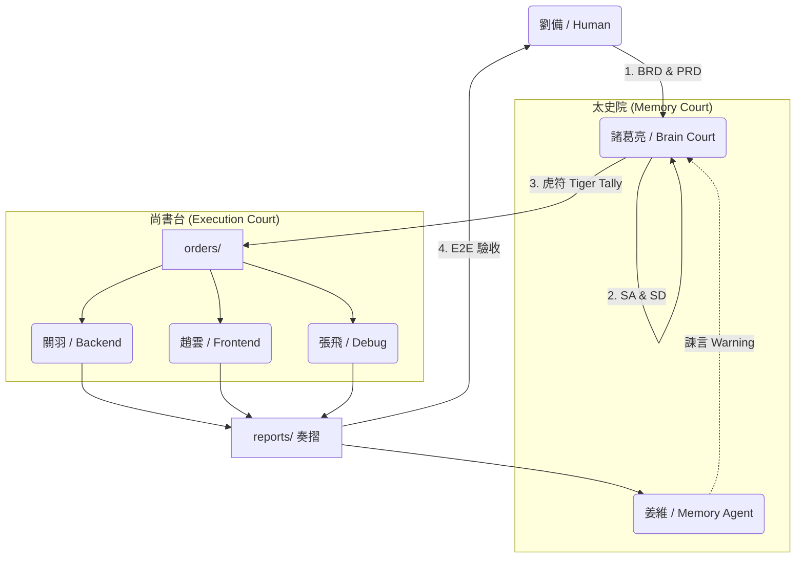

# 🧠 蜀漢智慧架構（Shu-Han Intelligence Architecture）

一套以「治理」為核心的多代理 AI 架構，而非單一 AI 工具。

- 人類決定方向（劉備）
- ChatGPT 負責推演與治理（諸葛亮）
- Agents 依正式軍令執行（虎符）
- 記憶系統防止重複犯錯
- 所有行為皆可追蹤、可審計、可測試

📜 入門必讀：`agents/AGENTS_v5.1.md`  
🐯 唯一合法指令來源：`orders/`（無虎符，不行動）  
🛡️ 資安規範：`docs/hacker.md`

**[English](README_EN.md)** | **[日本語](README_JA.md)**


## 蜀漢人工智慧國 — Agentic AI Governance Framework

[](https://opensource.org/licenses/MIT)
[](CONTRIBUTING.md)
[](agents/AGENTS_v5.1.md)

> **「AI 不是一個人工作，而是一個國家在運作。」**

這不是一個單純的 AI 工具庫。  
這是一套 **以治理、紀律與記憶為核心的多代理 AI 文明架構**。

本專案使用「蜀漢」作為隱喻，將 AI Agent 協作、文件制度、資安規範與測試流程，統一在一個 **可擴張、可審計、可演化** 的國家級系統中。

---

## 🚀 30 秒快速體驗

```bash
# 1. Clone 專案
git clone https://github.com/your-username/Shu-Han-Agentic-AI-Framework.git
cd Shu-Han

# 2. 將 agents/AGENTS_v5.1.md 貼給你的 ChatGPT/Claude 作為 System Prompt

# 3. 對 AI 說：
「請根據蜀漢框架，幫我分析這個需求並產生一份虎符」
```

---

## 🏛️ 核心理念 (Core Philosophy)

我們相信單純的 Prompt Engineering 無法支撐大規模系統，唯有 **「治理（Governance）」** 才能帶來穩定。

| 角色 | 職責 |
|------|------|
| **主君（劉備 / Human）** | 負責指引方向與最終決策 |
| **丞相（諸葛亮 / Strategic Core）** | 負責推演架構、拆解任務與發布軍令 |
| **五虎將（Agents / Execution Core）** | 負責專業執行（實作、除錯、UI） |
| **太史院（姜維 / Memory Core）** | 負責紀錄錯誤、主動諫言，避免歷史重演 |
| **虎符（Tiger Tally）** | 所有指令必須具備的唯一合法憑證 |

---

## ⚔️ 為什麼選擇蜀漢架構？ (Why This?)

| 一般 AI 開發 (Chaos) | 蜀漢治理架構 (Order) |
|:---|:---|
| **指令模糊**：一句話叫 AI 做完，細節全靠猜 | **虎符制度**：明確的 Context、邊界與驗收標準 |
| **記憶喪失**：開新對話就忘記教訓，Bug 重複出現 | **太史院諫言**：姜維主動檢索歷史錯誤，執行前先預警 |
| **權責不清**：寫 Code 的 AI 亂改架構與 UI | **權力分立**：關羽（實作）嚴禁修改 `specs/`，僅能執行 |
| **黑箱作業**：不知道 AI 改了哪裡，無法回溯 | **奏摺回報**：每一筆更動都有據可查，決策路徑清晰 |

---

## 🗺️ 系統架構圖 (System Architecture)



---

## 📜 最重要的文件 (Key Documents)

如果你只看三個檔案，請看這三份「立國之本」：

| 文件 | 說明 | 必讀程度 |
|------|------|----------|
| [agents/AGENTS_v5.1.md](agents/AGENTS_v5.1.md) | 國家治理架構 | ⭐⭐⭐ 必讀 |
| [agents/ALLSPARK_ShuHan_v1.md](agents/ALLSPARK_ShuHan_v1.md) | 軍紀憲章 | ⭐⭐⭐ 必讀 |
| [docs/hacker.md](docs/hacker.md) | 資安與防護規範 | ⭐⭐ 開發必讀 |

**延伸閱讀**：
- [agents/data_tracks_ShuHan_v1.md](agents/data_tracks_ShuHan_v1.md) — 軍令通訊協定（含 PR 指南）
- [CONTRIBUTING.md](CONTRIBUTING.md) — 貢獻指南

---

## 🧭 專案目錄導覽 (Directory Map)

```
/
├── agents/           # 🏛️ 國家治理核心（角色定義、憲法、通訊協定）
│   ├── AGENTS_v5.1.md
│   ├── ALLSPARK_ShuHan_v1.md
│   └── data_tracks_ShuHan_v1.md
├── specs/            # 📋 規格文件庫
│   ├── business/     # BRD / PRD（劉備的願景）
│   ├── system/       # SA / SD（諸葛亮的設計）
│   └── testing/      # E2E 測試場景
├── orders/           # 🐯 虎符（Agent 唯一合法指令來源）
├── reports/          # 📜 奏摺（Agent 執行回報）
├── code/             # ⚔️ 後端實作區（關羽駐地）
├── design/           # 🛡️ 前端與 UX 區（趙雲駐地）
├── sandbox/          # 🧪 實驗區（馬超駐地）
├── debug/            # 🔧 除錯與修復區（張飛駐地）
├── memory/           # 📚 太史院（姜維駐地）
│   ├── mistakes/     # 踩雷記錄
│   ├── patterns/     # 策略模式
│   └── sessions/     # 日常會話
├── tests/            # ✅ 自動化測試代碼
└── docs/             # 📖 文件
    └── hacker.md     # 資安規範
```

---

## 🐯 什麼是「虎符（Tiger Tally）」？

虎符是 Agent **唯一能接受的正式指令格式**。它解決了自然語言溝通中的「歧義」與「幻覺」。

📍 **位置**：`orders/ORD-SHU-YYYYMMDD-XX.md`

每一個虎符都必須包含：

| 區塊 | 說明 |
|------|------|
| 🎯 **戰略目標 (Directive)** | 做什麼？ |
| 📜 **依據文件 (Context)** | 根據哪份 PRD / SD？ |
| 🚧 **禁令與邊界 (Constraints)** | 什麼不能做？（引用 ALLSPARK） |
| ✅ **驗收標準 (Acceptance Criteria)** | 怎樣算做完？ |
| ⚠️ **升級條件 (Escalation)** | 失敗幾次要停止？ |

> **👉 沒有虎符，就不應該動 code。**

---

## 🛠️ 如何將此架構引入你的專案？

本專案是 **「文檔導向的作業系統（Doc-OS）」**，不依賴特定程式語言。

### Step 1: 複製核心
將 `agents/` 資料夾複製到你的專案根目錄。

### Step 2: 任命丞相
將 `AGENTS_v5.1.md` 的內容貼給你的 ChatGPT / Claude Project 作為 System Prompt。

### Step 3: 頒布憲法
在 `.cursorrules` 或 AI 設定中引用 `ALLSPARK_ShuHan_v1.md`。

### Step 4: 建立第一份 PRD
在 `specs/business/` 寫下你的需求。

### Step 5: 發布第一道虎符
請求丞相根據 PRD 生成 `orders/`，開始運作。

---

## 🚦 開發流程 (Workflow)

```
1️⃣ 劉備 提出願景 → specs/business/PRD.md
         ↓
2️⃣ 諸葛亮 轉化為設計 → specs/system/SD.md (含 hacker.md 檢查)
         ↓
3️⃣ 諸葛亮 發布虎符 → orders/ORD-001.md
         ↓
4️⃣ 姜維 查史諫言 (Check History)
         ↓
5️⃣ 五虎將 接令執行 → 產出 Code / Design
         ↓
6️⃣ 五虎將 上奏回報 → reports/REP-001.md
         ↓
7️⃣ 姜維 紀錄入史 → memory/
         ↓
8️⃣ E2E 測試 全綠 ✅ → 功能上線
```

---

## ⚠️ 重要原則 (Principles)

### ❌ 禁止事項
- **不要直接改 code 來「試試看」**：所有變更必須源自 SD
- **不要跳過架構設計**：沒有 SA/SD 的程式碼是債務，不是資產
- **不要下模糊指令**：AI 會猜測，而猜測是災難的開始

### ✅ 必須遵守
- **一切以虎符為準**：Code 必須與 Spec 一致
- **所有錯誤都應被記住**：失敗是養分，但不能被遺忘
- **安全紅線不可越**：涉及 DB/API 必須對照 `hacker.md`

---

## 🤝 參與貢獻

我們歡迎所有形式的貢獻！請先閱讀：

- [CONTRIBUTING.md](CONTRIBUTING.md) — 貢獻指南
- [agents/data_tracks_ShuHan_v1.md](agents/data_tracks_ShuHan_v1.md) §15-16 — PR/Issue 規範

### 快速開始
```bash
# Fork & Clone
git clone https://github.com/<your-username>/Shu-Han.git

# 建立 Branch
git checkout -b feat/SHU-YYYYMMDD-XX-your-feature

# 提交 PR
```

---

## 📋 Roadmap

- [x] v1.0 — 核心憲章與角色定義
- [x] v5.1 — 虎符制度與姜維諫言機制
- [ ] v6.0 — 自動化 CI/CD 整合
- [x] v7.0 — 多語言支援（English / 日本語）
- [ ] v8.0 — Web UI 管理介面

---

## 📄 License

本專案採用 [MIT License](LICENSE) 授權。

---

## 🏁 結語

這個 Repo 不追求「快」，  
它追求 **不再犯同樣的錯、能長期演化、能被接手**。

如果你理解這套制度，  
你不是在寫程式——  
**你是在參與一個智慧文明的運作。**

你可以用不同的「皮膚」運行同一個作業系統：

- **Cybertron 版**（Transfomer 版）
  - https://github.com/tairona717-code/Cybertron-Agentic-AI-Framework 
  - Autobots、ALLSPARK、Teletraan-1  
  - 直接向 Transformer 架構和 Transformers 宇宙致敬  

- **蜀漢版**（三國）  
  - 劉備（人類）、諸葛亮（核心 LLM）、五虎將作為專業代理  
  - 華語原生的敘事層，對應到相同的結構


---

<p align="center">
  <b>北伐出征，令出必行。</b><br>
  <i>Made with ❤️ by Tairona & The Shu-Han Architect Team</i>
</p>
