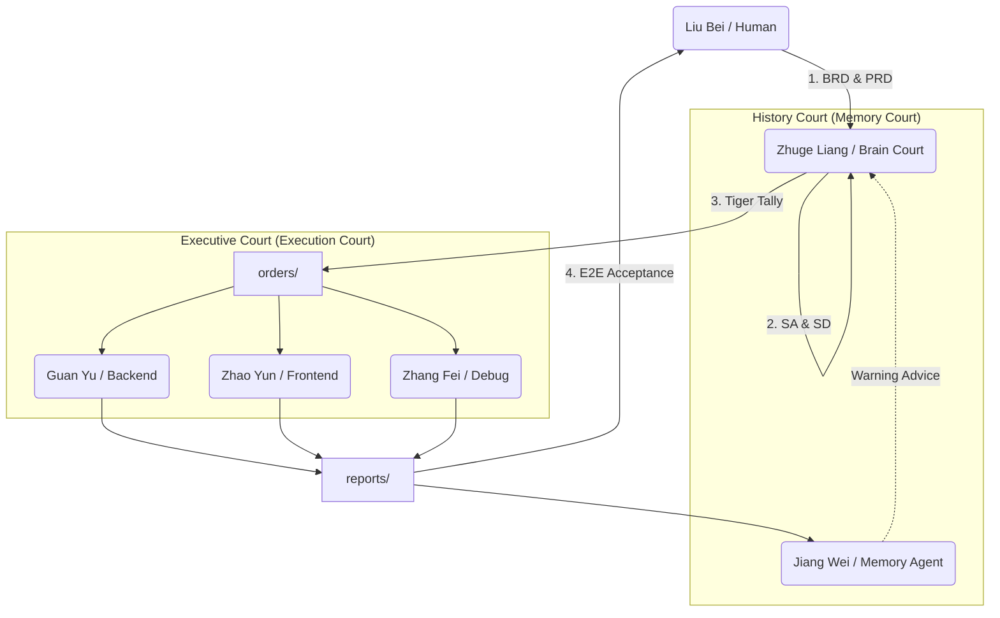

# 🧠 Shu-Han Intelligence Architecture

A governance-centered multi-agent AI architecture, not just another AI tool.

- Humans decide direction (Liu Bei)
- ChatGPT handles strategy & governance (Zhuge Liang)
- Agents execute via formal orders (Tiger Tally)
- Memory system prevents repeated mistakes
- All actions are traceable, auditable, and testable

📜 Essential reading: `agents/AGENTS_v5.1.md`  
🐯 Only legal command source: `orders/` (No Tiger Tally, No Action)  
🛡️ Security policy: `docs/hacker.md`

**[中文版 README](README.md)** | **[日本語版 README](README_JA.md)**

---

## Shu-Han AI Kingdom — Agentic AI Governance Framework

[](https://opensource.org/licenses/MIT)
[](CONTRIBUTING.md)
[](agents/AGENTS_v5.1.md)

> **"AI is not one person working, but a nation operating."**

This is not just an AI toolkit.  
This is a **multi-agent AI civilization architecture centered on governance, discipline, and memory**.

This project uses "Shu-Han" (an ancient Chinese kingdom) as a metaphor, unifying AI Agent collaboration, documentation systems, security policies, and testing processes into an **extensible, auditable, and evolvable** national-level system.

---

## 🚀 30-Second Quick Start

```bash
# 1. Clone the project
git clone https://github.com/tairona717-code/Shu-Han-Agentic-AI-Framework.git
cd Shu-Han

# 2. Paste agents/AGENTS_v5.1.md to your ChatGPT/Claude as System Prompt

# 3. Say to the AI:
"Please analyze this requirement and generate a Tiger Tally according to the Shu-Han framework"
```

---

## 🏛️ Core Philosophy

We believe simple Prompt Engineering cannot support large-scale systems. Only **"Governance"** can bring stability.

| Role | Responsibility |
|------|----------------|
| **Lord (Liu Bei / Human)** | Guide direction and make final decisions |
| **Prime Minister (Zhuge Liang / Strategic Core)** | Strategize architecture, decompose tasks, issue orders |
| **Five Tiger Generals (Agents / Execution Core)** | Professional execution (implementation, debugging, UI) |
| **History Court (Jiang Wei / Memory Core)** | Record errors, proactively advise, prevent history repeating |
| **Tiger Tally** | The only legal credential for all commands |

---

## ⚔️ Why Choose Shu-Han Architecture?

| Typical AI Development (Chaos) | Shu-Han Governance (Order) |
|:---|:---|
| **Vague commands**: One sentence to AI, details left to guessing | **Tiger Tally System**: Clear Context, boundaries & acceptance criteria |
| **Memory loss**: New conversation forgets lessons, bugs reappear | **History Court Advice**: Jiang Wei proactively retrieves past errors, warns before execution |
| **Unclear responsibilities**: AI writing code changes architecture and UI randomly | **Separation of powers**: Guan Yu (implementation) prohibited from modifying `specs/` |
| **Black box operations**: Unknown AI changes, untraceable | **Report System**: Every change documented, clear decision path |

---

## 🗺️ System Architecture



---

## 📜 Key Documents

If you only read three files, read these "founding documents":

| Document | Description | Priority |
|----------|-------------|----------|
| [agents/AGENTS_v5.1.md](agents/AGENTS_v5.1.md) | National governance architecture | ⭐⭐⭐ Must Read |
| [agents/ALLSPARK_ShuHan_v1.md](agents/ALLSPARK_ShuHan_v1.md) | Military discipline charter | ⭐⭐⭐ Must Read |
| [docs/hacker.md](docs/hacker.md) | Security & protection policy | ⭐⭐ Dev Must Read |

**Further Reading**:
- [agents/data_tracks_ShuHan_v1.md](agents/data_tracks_ShuHan_v1.md) — Command communication protocol (with PR guidelines)
- [CONTRIBUTING.md](CONTRIBUTING.md) — Contribution guide
- [examples/first_campaign/](examples/first_campaign/) — Evidence chain example

---

## 🧭 Directory Map

```
/
├── agents/           # 🏛️ National governance core (role definitions, constitution, protocols)
│   ├── AGENTS_v5.1.md
│   ├── ALLSPARK_ShuHan_v1.md
│   └── data_tracks_ShuHan_v1.md
├── specs/            # 📋 Specification library
│   ├── business/     # BRD / PRD (Liu Bei's vision)
│   ├── system/       # SA / SD (Zhuge Liang's design)
│   └── testing/      # E2E test scenarios
├── orders/           # 🐯 Tiger Tallies (Only legal command source for Agents)
├── reports/          # 📜 Reports (Agent execution reports)
├── code/             # ⚔️ Backend implementation (Guan Yu's station)
├── design/           # 🛡️ Frontend & UX (Zhao Yun's station)
├── sandbox/          # 🧪 Experiment area (Ma Chao's station)
├── debug/            # 🔧 Debug & fix (Zhang Fei's station)
├── memory/           # 📚 History Court (Jiang Wei's station)
│   ├── mistakes/     # Error records
│   ├── patterns/     # Strategy patterns
│   └── sessions/     # Daily sessions
├── tests/            # ✅ Automated test code
├── examples/         # 📖 Usage examples
│   └── first_campaign/  # Evidence chain template
└── docs/             # 📖 Documentation
    ├── hacker.md     # Security policy
    └── architecture/ # Architecture diagrams
```

---

## 🐯 What is "Tiger Tally"?

Tiger Tally is the **only formal command format** Agents can accept. It solves "ambiguity" and "hallucination" in natural language communication.

📍 **Location**: `orders/ORD-SHU-YYYYMMDD-XX.md`

Every Tiger Tally must include:

| Section | Description |
|---------|-------------|
| 🎯 **Directive** | What to do? |
| 📜 **Context** | Based on which PRD / SD? |
| 🚧 **Constraints** | What cannot be done? (Reference ALLSPARK) |
| ✅ **Acceptance Criteria** | How to verify completion? |
| ⚠️ **Escalation** | How many failures before stopping? |

> **👉 No Tiger Tally, no code changes.**

---

## 🛠️ How to Integrate This Architecture?

This project is a **"Document-Oriented Operating System (Doc-OS)"**, not dependent on any specific programming language.

### Step 1: Copy Core
Copy the `agents/` folder to your project root.

### Step 2: Appoint Prime Minister
Paste `AGENTS_v5.1.md` content to your ChatGPT / Claude Project as System Prompt.

### Step 3: Promulgate Constitution
Reference `ALLSPARK_ShuHan_v1.md` in `.cursorrules` or AI settings.

### Step 4: Create First PRD
Write your requirements in `specs/business/`.

### Step 5: Issue First Tiger Tally
Request Prime Minister to generate `orders/` based on PRD, start operating.

---

## 🚦 Development Workflow

```
1️⃣ Liu Bei proposes vision → specs/business/PRD.md
         ↓
2️⃣ Zhuge Liang transforms to design → specs/system/SD.md (with hacker.md check)
         ↓
3️⃣ Zhuge Liang issues Tiger Tally → orders/ORD-001.md
         ↓
4️⃣ Jiang Wei checks history & advises
         ↓
5️⃣ Five Tiger Generals receive orders → Output Code / Design
         ↓
6️⃣ Five Tiger Generals report → reports/REP-001.md
         ↓
7️⃣ Jiang Wei records to history → memory/
         ↓
8️⃣ E2E tests all green ✅ → Feature goes live
```

---

## ⚠️ Key Principles

### ❌ Prohibited
- **Don't change code to "try it out"**: All changes must originate from SD
- **Don't skip architecture design**: Code without SA/SD is debt, not asset
- **Don't give vague commands**: AI will guess, and guessing is the start of disaster

### ✅ Must Follow
- **Tiger Tally is the standard**: Code must match Spec
- **All errors must be remembered**: Failure is nutrition, but cannot be forgotten
- **Security red lines cannot be crossed**: DB/API must reference `hacker.md`

---

## 🤝 Contributing

We welcome all forms of contributions! Please read:

- [CONTRIBUTING.md](CONTRIBUTING.md) — Contribution guide
- [agents/data_tracks_ShuHan_v1.md](agents/data_tracks_ShuHan_v1.md) §15-16 — PR/Issue guidelines

### Quick Start
```bash
# Fork & Clone
git clone https://github.com/<your-username>/Shu-Han-Agentic-AI-Framework.git

# Create Branch
git checkout -b feat/SHU-YYYYMMDD-XX-your-feature

# Submit PR
```

---

## 📋 Roadmap

- [x] v1.0 — Core charter and role definitions
- [x] v5.1 — Tiger Tally system and Jiang Wei advice mechanism
- [ ] v6.0 — Automated CI/CD integration
- [x] v7.0 — Multi-language support (English/Japanese docs)
- [ ] v8.0 — Web UI management interface

---

## 📄 License

This project is licensed under [MIT License](LICENSE).

---

## 🏁 Conclusion

This repo doesn't pursue "fast",  
it pursues **never making the same mistake, long-term evolution, and handover-ready**.

If you understand this system,  
you're not writing code—  
**you're participating in an intelligent civilization's operation.**

You can run the same operating system with different "skins":

- **Cybertron Version** (Transformer Edition)  
  - Autobots, ALLSPARK, Teletraan-1  
  - Direct tribute to Transformer architecture and Transformers universe  

- **Shu-Han Version** (Three Kingdoms)  
  - Liu Bei (Human), Zhuge Liang (Core LLM), Five Tiger Generals as specialized agents  
  - Chinese-native narrative layer, mapping to the same structure

---

<p align="center">
  <b>Northern Expedition begins, orders must be followed.</b><br>
  <i>Made with ❤️ by Tairona & The Shu-Han Architect Team</i>
</p>
