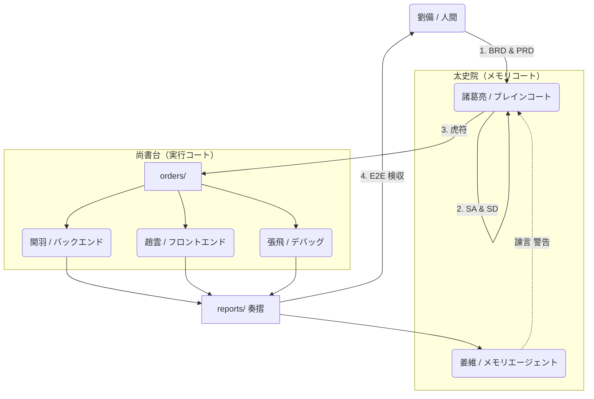

# 🧠 蜀漢知能アーキテクチャ（Shu-Han Intelligence Architecture）

単なるAIツールではなく、「ガバナンス」を中核としたマルチエージェントAIアーキテクチャ。

- 人間が方向を決定（劉備）
- ChatGPTが戦略とガバナンスを担当（諸葛亮）
- エージェントは正式な軍令で実行（虎符）
- 記憶システムが同じ過ちの繰り返しを防止
- すべての行動は追跡可能、監査可能、テスト可能

📜 必読：`agents/AGENTS_v5.1.md`  
🐯 唯一の合法的な命令源：`orders/`（虎符なくば行動せず）  
🛡️ セキュリティポリシー：`docs/hacker.md`

**[中文版 README](README.md)** | **[English README](README_EN.md)**

---

## 蜀漢人工知能国 — エージェントAIガバナンスフレームワーク

[](https://opensource.org/licenses/MIT)
[](CONTRIBUTING.md)
[](agents/AGENTS_v5.1.md)

> **「AIは一人の仕事ではなく、一つの国家が運営している。」**

これは単なるAIツールキットではありません。  
**ガバナンス、規律、記憶を中核としたマルチエージェントAI文明アーキテクチャ**です。

本プロジェクトは「蜀漢」（古代中国の王国）をメタファーとして使用し、AIエージェントの協力、文書制度、セキュリティ規範、テストプロセスを**拡張可能、監査可能、進化可能**な国家レベルのシステムに統一しています。

---

## 🚀 30秒クイックスタート

```bash
# 1. プロジェクトをクローン
git clone https://github.com/tairona717-code/Shu-Han-Agentic-AI-Framework.git
cd Shu-Han

# 2. agents/AGENTS_v5.1.md をChatGPT/ClaudeのSystem Promptとして貼り付け

# 3. AIに言う：
「蜀漢フレームワークに従って、この要件を分析し、虎符を生成してください」
```

---

## 🏛️ 核心理念（Core Philosophy）

単純なプロンプトエンジニアリングでは大規模システムを支えることはできません。**「ガバナンス」**だけが安定をもたらします。

| 役割 | 責任 |
|------|------|
| **主君（劉備 / 人間）** | 方向を指示し、最終決定を行う |
| **丞相（諸葛亮 / 戦略コア）** | アーキテクチャを策定、タスクを分解、軍令を発布 |
| **五虎将（エージェント / 実行コア）** | 専門的な実行（実装、デバッグ、UI） |
| **太史院（姜維 / メモリコア）** | エラーを記録、積極的に諫言、歴史の繰り返しを防止 |
| **虎符（タイガータリー）** | すべての命令に必要な唯一の合法的な資格証明 |

---

## ⚔️ なぜ蜀漢アーキテクチャを選ぶのか？

| 一般的なAI開発（混沌） | 蜀漢ガバナンス（秩序） |
|:---|:---|
| **曖昧な指示**：一文でAIに任せ、詳細は推測 | **虎符制度**：明確なコンテキスト、境界、受け入れ基準 |
| **記憶喪失**：新しい会話で教訓を忘れ、バグが再発 | **太史院の諫言**：姜維が過去のエラーを事前に検索し警告 |
| **責任不明確**：コードを書くAIがアーキテクチャとUIを勝手に変更 | **権力分立**：関羽（実装）は`specs/`の変更を禁止 |
| **ブラックボックス**：AIの変更が不明、追跡不可能 | **奏摺報告**：すべての変更が文書化、明確な意思決定経路 |

---

## 🗺️ システムアーキテクチャ



---

## 📜 最重要文書（Key Documents）

3つのファイルだけを読むなら、この「建国の基本」を読んでください：

| 文書 | 説明 | 必読度 |
|------|------|--------|
| [agents/AGENTS_v5.1.md](agents/AGENTS_v5.1.md) | 国家ガバナンスアーキテクチャ | ⭐⭐⭐ 必読 |
| [agents/ALLSPARK_ShuHan_v1.md](agents/ALLSPARK_ShuHan_v1.md) | 軍紀憲章 | ⭐⭐⭐ 必読 |
| [docs/hacker.md](docs/hacker.md) | セキュリティと防護規範 | ⭐⭐ 開発必読 |

**追加資料**：
- [agents/data_tracks_ShuHan_v1.md](agents/data_tracks_ShuHan_v1.md) — 軍令通信プロトコル（PRガイドライン含む）
- [CONTRIBUTING.md](CONTRIBUTING.md) — 貢献ガイド
- [examples/first_campaign/](examples/first_campaign/) — エビデンスチェーン例

---

## 🧭 ディレクトリマップ

```
/
├── agents/           # 🏛️ 国家ガバナンスコア（役割定義、憲法、プロトコル）
│   ├── AGENTS_v5.1.md
│   ├── ALLSPARK_ShuHan_v1.md
│   └── data_tracks_ShuHan_v1.md
├── specs/            # 📋 仕様書ライブラリ
│   ├── business/     # BRD / PRD（劉備のビジョン）
│   ├── system/       # SA / SD（諸葛亮の設計）
│   └── testing/      # E2Eテストシナリオ
├── orders/           # 🐯 虎符（エージェントの唯一の合法命令源）
├── reports/          # 📜 奏摺（エージェント実行報告）
├── code/             # ⚔️ バックエンド実装（関羽の駐屯地）
├── design/           # 🛡️ フロントエンド＆UX（趙雲の駐屯地）
├── sandbox/          # 🧪 実験エリア（馬超の駐屯地）
├── debug/            # 🔧 デバッグ＆修正（張飛の駐屯地）
├── memory/           # 📚 太史院（姜維の駐屯地）
│   ├── mistakes/     # エラー記録
│   ├── patterns/     # 戦略パターン
│   └── sessions/     # 日常セッション
├── tests/            # ✅ 自動化テストコード
├── examples/         # 📖 使用例
│   └── first_campaign/  # エビデンスチェーンテンプレート
└── docs/             # 📖 ドキュメント
    ├── hacker.md     # セキュリティポリシー
    └── architecture/ # アーキテクチャ図
```

---

## 🐯 「虎符（タイガータリー）」とは？

虎符はエージェントが受け入れられる**唯一の正式な命令フォーマット**です。自然言語コミュニケーションにおける「曖昧さ」と「幻覚」を解決します。

📍 **場所**：`orders/ORD-SHU-YYYYMMDD-XX.md`

すべての虎符には以下が含まれる必要があります：

| セクション | 説明 |
|------------|------|
| 🎯 **戦略目標（Directive）** | 何をするか？ |
| 📜 **根拠文書（Context）** | どのPRD / SDに基づくか？ |
| 🚧 **禁令と境界（Constraints）** | 何ができないか？（ALLSPARK参照） |
| ✅ **受け入れ基準（Acceptance Criteria）** | 完了をどう確認するか？ |
| ⚠️ **エスカレーション条件（Escalation）** | 何回失敗したら停止するか？ |

> **👉 虎符なくば、コード変更なし。**

---

## 🛠️ このアーキテクチャをプロジェクトに導入する方法

本プロジェクトは**「ドキュメント指向オペレーティングシステム（Doc-OS）」**であり、特定のプログラミング言語に依存しません。

### ステップ1：コアをコピー
`agents/`フォルダをプロジェクトルートにコピー。

### ステップ2：丞相を任命
`AGENTS_v5.1.md`の内容をChatGPT / Claude ProjectのSystem Promptとして貼り付け。

### ステップ3：憲法を公布
`.cursorrules`またはAI設定で`ALLSPARK_ShuHan_v1.md`を参照。

### ステップ4：最初のPRDを作成
`specs/business/`に要件を記述。

### ステップ5：最初の虎符を発布
丞相にPRDに基づいて`orders/`を生成するよう依頼し、運用開始。

---

## 🚦 開発ワークフロー

```
1️⃣ 劉備がビジョンを提案 → specs/business/PRD.md
         ↓
2️⃣ 諸葛亮が設計に変換 → specs/system/SD.md（hacker.mdチェック含む）
         ↓
3️⃣ 諸葛亮が虎符を発布 → orders/ORD-001.md
         ↓
4️⃣ 姜維が履歴を確認＆諫言
         ↓
5️⃣ 五虎将が命令を受領 → コード/デザインを出力
         ↓
6️⃣ 五虎将が報告を上奏 → reports/REP-001.md
         ↓
7️⃣ 姜維が履歴に記録 → memory/
         ↓
8️⃣ E2Eテストがすべてグリーン ✅ → 機能リリース
```

---

## ⚠️ 重要な原則（Principles）

### ❌ 禁止事項
- **「試してみる」ためにコードを直接変更しない**：すべての変更はSDから発生する必要がある
- **アーキテクチャ設計をスキップしない**：SA/SDのないコードは負債であり、資産ではない
- **曖昧な指示を与えない**：AIは推測し、推測は災害の始まり

### ✅ 必須遵守
- **虎符が基準**：コードはSpecと一致する必要がある
- **すべてのエラーを記憶**：失敗は栄養だが、忘れてはならない
- **セキュリティレッドラインを越えない**：DB/APIは`hacker.md`を参照必須

---

## 🤝 コントリビューション

あらゆる形式の貢献を歓迎します！まず以下をお読みください：

- [CONTRIBUTING.md](CONTRIBUTING.md) — 貢献ガイド
- [agents/data_tracks_ShuHan_v1.md](agents/data_tracks_ShuHan_v1.md) §15-16 — PR/Issueガイドライン

### クイックスタート
```bash
# Fork & Clone
git clone https://github.com/<your-username>/Shu-Han-Agentic-AI-Framework.git

# ブランチを作成
git checkout -b feat/SHU-YYYYMMDD-XX-your-feature

# PRを提出
```

---

## 📋 ロードマップ

- [x] v1.0 — コア憲章と役割定義
- [x] v5.1 — 虎符制度と姜維諫言メカニズム
- [ ] v6.0 — 自動化CI/CD統合
- [x] v7.0 — 多言語サポート（英語/日本語ドキュメント）
- [ ] v8.0 — Web UI管理インターフェース

---

## 📄 ライセンス

本プロジェクトは[MITライセンス](LICENSE)の下でライセンスされています。

---

## 🏁 結語

このリポジトリは「速さ」を追求しません。  
**同じ過ちを繰り返さない、長期的な進化、引き継ぎ可能**を追求します。

このシステムを理解するなら、  
あなたはコードを書いているのではなく—  
**知的文明の運営に参加しています。**

同じオペレーティングシステムを異なる「スキン」で実行できます：

- **サイバトロン版**（トランスフォーマーエディション）  
  - オートボット、ALLSPARK、テレトラン1  
  - トランスフォーマーアーキテクチャとトランスフォーマー宇宙への直接オマージュ  

- **蜀漢版**（三国志）  
  - 劉備（人間）、諸葛亮（コアLLM）、五虎将が専門エージェントとして  
  - 中国語ネイティブのナラティブレイヤー、同じ構造にマッピング

---

<p align="center">
  <b>北伐出征、令出必行。</b><br>
  <i>Made with ❤️ by Tairona & The Shu-Han Architect Team</i>
</p>
