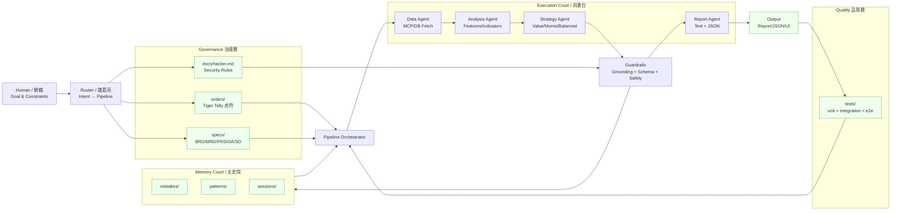

# Shu-Han Architecture Overview

## 系統架構圖



## 架構說明

### 1. 人類介面層 (Human Interface)

- **劉備 (Human)**：提供目標與約束條件
- 輸入：自然語言需求
- 輸出：結構化 Intent

### 2. 路由層 (Router)

- **諸葛亮 (Orchestrator)**：意圖理解與 Pipeline 分派
- 責任：
  - 解析用戶意圖
  - 選擇適當 Pipeline
  - 決定 Agent 調度策略

### 3. 治理層 (Governance)

| 組件 | 說明 |
|------|------|
| `orders/` | 虎符（軍令），定義任務邊界 |
| `specs/` | 規格文件（BRD/PRD/SA/SD） |
| `docs/hacker.md` | 資安政策 |

### 4. 執行層 (Execution Court / 尚書台)

| Agent | 職責 |
|-------|------|
| Data Agent | 資料拉取（MCP/DB） |
| Analysis Agent | 特徵計算、指標分析 |
| Strategy Agent | 策略生成 |
| Report Agent | 輸出格式化 |

### 5. 防護層 (Guardrails)

- **Grounding**：確保輸出有資料依據
- **Schema**：驗證輸出格式
- **Safety**：安全檢查（參照 `docs/hacker.md`）

### 6. 記憶層 (Memory Court / 太史院)

| 目錄 | 用途 |
|------|------|
| `mistakes/` | 錯誤記錄，避免重犯 |
| `patterns/` | 可重用規則 |
| `sessions/` | Pipeline 執行摘要 |

### 7. 品質層 (Quality)

- Unit Tests
- Integration Tests
- E2E Tests

## 資料流

```
User Request
    │
    ▼
┌─────────┐
│ Router  │ ──────────────────────┐
└────┬────┘                       │
     │                            ▼
     │                    ┌──────────────┐
     │                    │  Governance  │
     │                    │  (虎符/規格)  │
     │                    └──────┬───────┘
     │                           │
     ▼                           ▼
┌─────────────────────────────────────────┐
│            Pipeline Orchestrator         │
├─────────────────────────────────────────┤
│  Data → Analysis → Strategy → Guardrail │
└────────────────────┬────────────────────┘
                     │
         ┌───────────┼───────────┐
         ▼           ▼           ▼
    ┌────────┐  ┌────────┐  ┌────────┐
    │ Output │  │ Memory │  │ Tests  │
    └────────┘  └────────┘  └────────┘
```

## 相關文件

- [AGENTS_v5.1.md](../../agents/AGENTS_v5.1.md) - 國家治理架構
- [data_tracks_ShuHan_v1.md](../../agents/data_tracks_ShuHan_v1.md) - 通訊協定
- [ALLSPARK_ShuHan_v1.md](../../agents/ALLSPARK_ShuHan_v1.md) - 軍紀憲章
- [hacker.md](../hacker.md) - 資安政策
